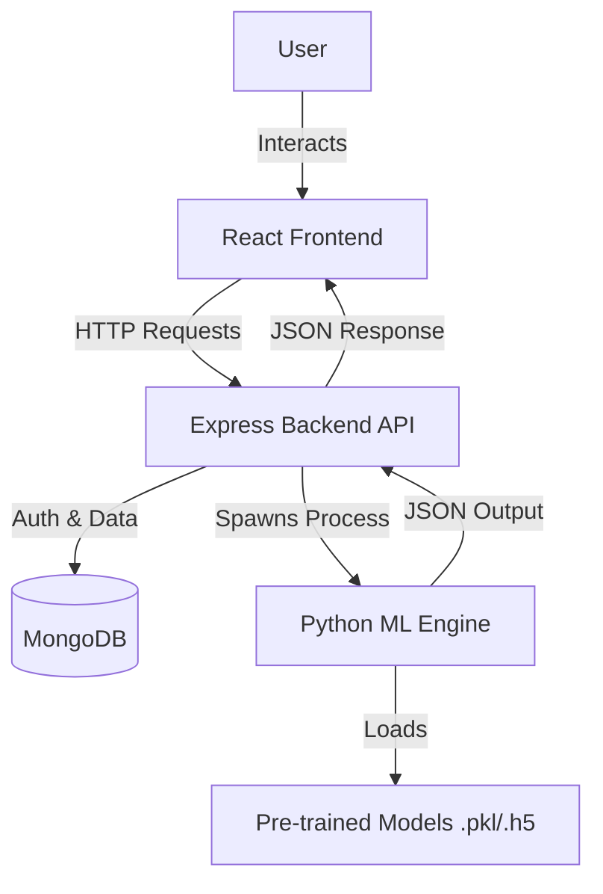

# Multi-Predict - Multi-Disease Prediction System

Multi-Predict is a comprehensive web application designed to assist in the early detection of multiple diseases. It integrates advanced Machine Learning models with a modern, responsive Web Interface to provide instant risk assessments for Heart Disease, Diabetes, Breast Cancer, and Lung Cancer.

## 🏗️ System Architecture

The system follows a modular architecture separating the Client, Server, and Machine Learning components:



## 🚀 Key Features

*   **Heart Disease Analysis**: Predicts risk using clinical parameters (Age, BP, Cholesterol, etc.) via Random Forest/Logistic Regression models.
*   **Diabetes Risk Assessment**: Evaluates health metrics to determine diabetes likelihood.
*   **Breast Cancer Detection**: Deep Learning based classification of Ultrasound images (Benign/Malignant).
*   **Lung Cancer Screening**: Convolutional Neural Network (CNN) analysis of CT Scan images.
*   **Secure User System**: Full authentication flow with JWT (JSON Web Tokens) and bcrypt password hashing.
*   **Instant Medical Reports**: Generates downloadable PDF reports with prediction results and timestamps.
*   **Modern UI/UX**: Glassmorphism design, responsive layout, and real-time feedback.

---

## 🛠️ Technology Stack

| Component | Technologies |
| :--- | :--- |
| **Frontend** | React (Vite), CSS3 (Modules/Glassmorphism), Axios, React Router v6 |
| **Backend** | Node.js, Express.js, Mongoose, JWT, Multer (File Uploads) |
| **Database** | MongoDB (Local or Atlas) |
| **ML Engine** | Python 3, TensorFlow/Keras, Scikit-Learn, NumPy, Pandas, Pillow |
| **Tools** | Concurrently, Python-Shell, PDF-Lib |

---

## 📋 Prerequisites

Ensure you have the following installed on your system:

*   **Node.js** (v14 or higher) & **npm**
*   **Python** (v3.8 - v3.11)
    *   *Note: TensorFlow compatibility is best with Python 3.8-3.11.*
*   **MongoDB** (Running locally on default port `27017` or a cloud Atlas URI)

---

## 📦 Installation & Setup

### 1. Clone the Repository
```bash
git clone https://github.com/Tishyaketu/multiPredict.git
cd Multi-Predict
```

### 2. Install Dependencies (Automated)
We have a script to install dependencies for the Root, Backend, and Frontend automatically:
```bash
npm run install-all
```

### 3. Setup Machine Learning Environment
The Python environment needs to be set up manually to ensure all ML libraries are available.

```bash
cd ML
# Create a virtual environment
python -m venv venv

# Activate the virtual environment
# On Windows:
# venv\Scripts\activate
# On macOS/Linux:
source venv/bin/activate

# Install Python dependencies
pip install -r requirements.txt
```
> **Important**: Ensure your virtual environment is named `venv` as the backend is configured to look for the python executable at `ML/venv/bin/python` (or `Scripts/python` on Windows).

### 4. Application Configuration

**Backend Variables**
Check `Backend/.env`. It is auto-generated, but ensure it matches your environment:
```env
PORT=8000
MONGODB_URI=mongodb://localhost:27017/multi_predict_db
CORS_ORIGIN=http://localhost:5173
JWT_SECRET=your_super_secret_key_change_this
```

**Frontend Constants**
The frontend is configured to talk to `http://localhost:8000`. If you change the backend port, update the API base URL in the frontend config.

---

## 🏃‍♂️ Running the Application

You can run the full stack (Frontend + Backend) with a single command from the root directory:

```bash
npm run dev
```

*   **Frontend**: Open [http://localhost:5173](http://localhost:5173) to view the app.
*   **Backend**: Running at [http://localhost:8000](http://localhost:8000).

### Running Components Individually

**Backend Only**
```bash
cd Backend
npm run dev
```

**Frontend Only**
```bash
cd Frontend
npm run dev
```

---

## 🔧 Troubleshooting

| Issue | Possible Cause | Solution |
| :--- | :--- | :--- |
| **Connect ECONNREFUSED** | MongoDB is not running. | Start your MongoDB service (`sudo systemctl start mongod` or via Docker). |
| **Python not found / Spawn error** | Backend cannot find the python executable. | Ensure you created the `venv` in the `ML` folder and installed requirements. Check `Backend/src/utils/pythonRunner.js` path configuration. |
| **Module not found** (Python) | Dependencies not installed in venv. | Activate venv and run `pip install -r requirements.txt`. |
| **CORS Error** | Frontend/Backend port mismatch. | Ensure `CORS_ORIGIN` in `.env` matches your frontend URL. |

---

## 📄 License

This project is licensed under the MIT License.
